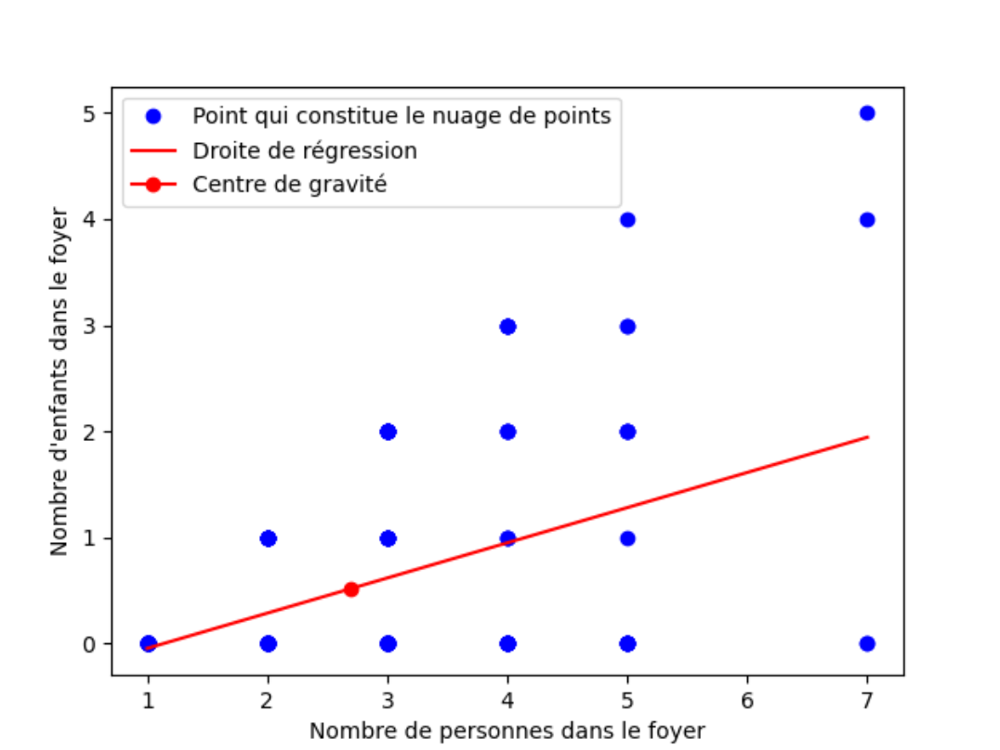

# Saé S2.04 - Exploitation statistique d'une base de données
*Yoann Hoertner (102) & Hugo Pereira (102)*
### Approche mathématiques statistiques
* [Les notions](#chapter1)
* [Partie python](#chapter2)
	* [La moyenne](#section2_1)
	* [La variance](#section2_2)
	* [L'écart type](#section2_3)
	* [La médiane](#section2_4)
	* [Les quartiles](#section2_5)
	* [Les percentiles](#section2_6)
	* [Tri à plat](#section2_7)
	* [Boîte à moustache](#section2_8)
	* [Histogramme](#section2_9)
	* [La covariance](#section2_10)
	* [Le coefficient de corrélation, l'équation et la droite de régression](#section2_11)	
    * [Le mode](#section2_12)	
    * [Boîte à moustache sur population stratifiée](#section2_13)
* [Partie Excel](#chapter3)
	* [La moyenne](#section3_1)
	* [La variance](#section3_2)
	* [L'écart type](#section3_3)
	* [La médiane](#section3_4)
	* [Les quartiles](#section3_5)
	* [Les percentiles](#section3_6)
	* [Tri à plat](#section3_7)
	* [La covariance](#section3_8)
	* [Le coefficient de corrélation](#section3_9)	
	* [L'équation et la droite de régression](#section3_10)
    * [Le camembert](#section3_11)	
    * [Histogramme](#section3_12)	

## Les notions <a class="anchor" id="chapter1"></a>


Liste des notions traitées ou non traitée ([lien du PDF](./assets/TODO.pdf))

## Partie python <a class="anchor" id="chapter2"></a>
Voici la liste des bibliothèques que nous utilisons lors de nos requêtes :
```python
import statistics # pour récupérer des fonctions de statistique
from pandas import *  # pour lire, importer et manipuler des données sous forme tableur
from numpy import *  # pour faire des calculs
from matplotlib.pylab import *  # pour faire des graphiques
from scipy.stats import linregress # pour calculer ce qui est en rapport avec la droite de régression
```

Nous rajoutons l'importation des feuilles du fichier excel que nous utiliserons :
```python
produit = read_excel('ClasseurBaseTicketsSAE.xlsx', 'Produit')
carteFidelite = read_excel('ClasseurBaseTicketsSAE.xlsx', 'CarteFidelite')
ville = read_excel('ClasseurBaseTicketsSAE.xlsx', 'Ville')
detailTicket = read_excel('ClasseurBaseTicketsSAE.xlsx', 'DetailTicket')
```

## La moyenne <a class="anchor" id="section2_1"></a>
*Calcul :*
```python
PrixUnit = produit.Prix_Unit.values
print("En moyenne, un produit coûte", round(mean(PrixUnit), 2), "€")
```
*Résultat et interprétation :*
```
En moyenne, un produit coûte 8.43 €
```

## La variance <a class="anchor" id="section2_2"></a>
*Calcul :*
```python
PrixUnit = produit.Prix_Unit.values
print("La variance des prix unitaires des produits est de", round(var(PrixUnit), 2))
```
*Résultat :*
```
La variance des prix unitaires des produits est de 25.82
```
*Interprétation :*

La variance ne nous permet pas d'analyser car elle n'a pas d'unité. On sait que plus elle est grandre plus les écarts entre les prix et la moyenne sont élevés mais nous attendrons d'avoir l'écart type pour récupérer l'unité.

## L'écart type <a class="anchor" id="section2_3"></a>
*Calcul :*
```python
Unites_Stock = produit.Unites_Stock.values
print("L'écart type des prix unitaires des produits est de", round(std(PrixUnit), 2), "€")
```
*Résultat* :
```
L'écart type des prix unitaires des produits est de 5.08 €
```
*Interprétation* :

L'écart type nous permet de mesurer (à l'instar de la variance) la dispersion des valeurs autour de la moyenne. D'après le résultat, on en conclut que la population est homogène car 5 €uros n'est pas un coût très élevé.

## La médiane <a class="anchor" id="section2_4"></a>
*Calcul :*
```python
NbPerFoyer = carteFidelite.NbPerFoyer.values
print("La médiane du nombre de personnes par foyer est de :", np.percentile(NbPerFoyer, 50), "personne(s).")
```
*Résultat* :
```
La médiane du nombre de personnes par foyer est de : 3.0 personne(s).
```
*Interprétation* :

Cela veut dire qu'il y a autant de foyer qui se trouvent en dessous de 3 personnes que de familles qui se trouvent au dessus.

## Les quartiles <a class="anchor" id="section2_5"></a>
*Calcul :*
```python
NbPerFoyer = carteFidelite.NbPerFoyer.values
print("Le premier quartile du nombre de personnes par foyer est de :", np.percentile(NbPerFoyer, 25), "personne(s).")
```
*Résultat* :
```
Le premier quartile du nombre de personnes par foyer est de : 2.0 personne(s).
```
*Interprétation* :

25% des foyers sont composés d'un maximum de 2 personnes.

## Les percentiles <a class="anchor" id="section2_6"></a>
*Calcul :*
```python
NbPerFoyer = carteFidelite.NbPerFoyer.values
print("Le 10ème percentile du nombre de personnes par foyer est de :", np.percentile(NbPerFoyer, 10), "personne(s).")
```
*Résultat* :
```
Le 10ème percentile du nombre de personnes par foyer est de : 1.0 personne(s).
```
*Interprétation* :

10% des foyers sont composés de 1 personnes ou moins.

## Tri à plat <a class="anchor" id="section2_7"></a>
*Calcul :*
```python
PrixUnit = produit.Prix_Unit.values
Z = []
for i in PrixUnit:
    Z.append(round(i, 0))
plt.hist(Z, bins=[0, 5, 10, 15, 20, 60, 70], edgecolor='red')
title("Répartition des prix unitaires")
plt.show()
```
*Résultat* :


*Interprétation* :

On remarque grâce à notre tri à plat qu'une grande partie des prix des produits se trouve entre 5 et 10 €uros. On remarque également que l'entreprise ne vend que très peu de produit cher. En effet, les produits se trouvent majoritairement entre 5 et 15 €uros.

## Boîte à moustache <a class="anchor" id="section2_8"></a>
*Calcul :*
```python
distanceVille = ville.DistanceKM.values
boxplot(distanceVille)
gca().xaxis.set_ticklabels(['Toutes les distances'])
title("Variable DistanceKM")
show()
```
*Résultat* :


*Interprétation* :

Grâce à cette boîte à moustache, on peut dire que la ville la plus loin du magasin se trouve à plus de 50 km. De plus, 75 % des villes se situent à moins de 30 km du magasin. De plus, 25 % des villes se situent à moins de 25 km. Enfin, la médiane est située aux alentours de 25 km. C'est-à-dire qu'il y a autant de villes à plus de 25 km que de villes à moins de 25 km.

## Histogramme <a class="anchor" id="section2_9"></a>
*Calcul :*
```python
distanceVille = ville.DistanceKM.values
Z = []
for i in distanceVille:
    Z.append(i)
plt.hist(Z, edgecolor='red')
title("Répartition de la distance en km des villes par rapport au magasin")
plt.show()
```
*Résultat* :


*Interprétation* :

L'histogramme nous montre graphiquement que une grande partie des villes se trouve à une trenteine de km du magasin. Les deux villes les plus éloignées se trouvent entre 45 et 55km. Enfin, il existe 3 villes qui se trouvent à moins de 5km. 

## La covariance <a class="anchor" id="section2_10"></a>
*Calcul :*
```python
nbPerFoyer = carteFidelite.NbPerFoyer.values
nbEnfant = carteFidelite.NbEnfant.values
cov = mean(nbPerFoyer*nbEnfant)-mean(nbPerFoyer)*mean(nbEnfant)
print("La covariance entre la variable du nombre de personnes par foyer et celle du nombre d'enfants par foyer est de", round(cov, 2))
```
*Résultat* :
```
La covariance entre la variable du nombre de personnes par foyer et celle du nombre d'enfants par foyer est de 0.62
```
*Interprétation* :

//à écrire

## Le coefficient de corrélation, l'équation et la droite de régression <a class="anchor" id="section2_11"></a>
*Calcul :*
```python
nbPerFoyer = carteFidelite.NbPerFoyer.values
nbEnfant = carteFidelite.NbEnfant.values
params = linregress(nbPerFoyer, nbEnfant)
N = len(nbEnfant)
a = params[0]
b = params[1]
coefCor = params[2]
y_mod = []
for i in range(N):
    y_mod.append(a * nbPerFoyer[i] + b)
print("Le coefficient de corrélation entre le nombre d'enfants par rapport au nombre de personnes par foyer est de", round(coefCor,2))
print("L'équation de la droite de régression est de : y =", round(a, 2),"x +", round(b, 2))
plot(nbPerFoyer, nbEnfant, "bo", label = "Point qui constitue le nuage de points")
plot(nbPerFoyer, y_mod, "r-", label = "Droite de régression")
xlabel("Nombre de personnes dans le foyer")
ylabel("Nombre d'enfants dans le foyer")
plot(mean(nbPerFoyer),mean(nbEnfant), marker="o", color="red", label = "Centre de gravité")
legend()
show()
```
*Résultat* :
```
Le coefficient de corrélation entre le nombre d'enfants par rapport au nombre de personnes par foyer est de 0.47
L'équation de la droite de régression est de : y = 0.33 x + -0.38



```
*Interprétation* :

Le coefficient de corrélation est supérieur à 0. Cela signifie que lorsque le nombre de personnes dans le foyer augmente, le nombre d'enfants dans ce même foyer à tendance à augmenter. Notre coefficient n'est pas proche de 0 donc les variations de ces deux variables ne sont pas indépendantes. 

## Le mode <a class="anchor" id="section2_12"></a>
*Calcul :*
```python
prenom = carteFidelite.Prenom.values
print("Le prénom le plus représenté dans la liste des clients fidèles (mode) est", statistics.mode(prenom))
```
*Résultat* :
```
Le prénom le plus représenté dans la liste des clients fidèles (mode) est Chloé
```
*Interprétation* :

Le mode vise à trouver l'élément qui est le plus présent dans la variable. Il peut être utilisé avec des variables qualitatives. De ce fait nous avons déterminé que le nom le plus présent dans la variable Prenom est celui de Chloé.

## Boîte à moustache sur population stratifiée <a class="anchor" id="section2_13"></a>
*Calcul :*
```python
PrixUnit = produit.Prix_Unit.values	
CodeRayon = produit.Code_rayon.values
boxplot([PrixUnit[CodeRayon == 32], PrixUnit[CodeRayon == 37], PrixUnit[CodeRayon == 54]])
gca().xaxis.set_ticklabels(['Légumes', 'Oeufs', 'Viandes'])
title("Variable Prix_Unit suivant le nom des rayons")
show()
```
*Résultat* :


*Interprétation* :

Le fait de disposer ces trois boîtes à moustache nous permet de comparer les prix des trois rayons. On d'office que les produits au rayon des viandes sont plus chers que les légumes et que les oeufs.

On remarque aussi qu'il existe une viande particulièrement chère à plus de 30 €.

## Partie Excel <a class="anchor" id="chapter3"></a>

## La moyenne <a class="anchor" id="section3_1"></a>
*Calcul :*
```excel
=AVERAGE(Produit!H2:H3116)
```
*Résultat et interprétation :*


## La variance <a class="anchor" id="section3_2"></a>
*Calcul :*
```excel
=VAR.P(Produit!G:G)
```
*Résultat et interprétation :*


L'interprétation est la même que pour python (cf. [La variance](#section2_2))

## L'écart type <a class="anchor" id="section3_3"></a>
*Calcul :*
```excel
=SQRT(VAR.P(Produit!G:G))
```
*Résultat et interprétation :*


L'interprétation est la même que pour python (cf. [L'écart type](#section2_3))

## La médiane <a class="anchor" id="section3_4"></a>
*Calcul :*
```excel
=MEDIAN(CarteFidelite!H:H)
```
*Résultat et interprétation :*


L'interprétation est la même que pour python (cf. [La médiane](#section2_4))

## Les quartiles <a class="anchor" id="section3_5"></a>
*Calcul :*
```excel
=QUARTILE(CarteFidelite!H:H;1)
```
*Résultat et interprétation :*


L'interprétation est la même que pour python (cf. [Les quartiles](#section2_5))

## Les percentiles <a class="anchor" id="section3_6"></a>
*Calcul :*
```excel
=PERCENTILE(CarteFidelite!H:H;0,1)
```
*Résultat et interprétation :*


L'interprétation est la même que pour python (cf. [Les percentiles](#section2_6))

## Le tri à plat <a class="anchor" id="section3_7"></a>
*Calcul :*
```excel
=FREQUENCY(Ville!D2:D15;Cacluls!A10:A16)
```
*Résultat et interprétation :*


L'interprétation est la même que pour python (cf. [Tri à plat](#section2_7))

## La covariance <a class="anchor" id="section3_8"></a>
*Résultat et interprétation :*


L'interprétation est la même que pour python (cf. [La covariance](#section2_10))

## Le coefficient de corrélation <a class="anchor" id="section3_9"></a>
*Calcul :*
```excel
=CORREL(CarteFidelite!H:H;CarteFidelite!J:J)
```
*Résultat et interprétation :*


L'interprétation est la même que pour python (cf. [Le coefficient de corrélation](#section2_11))

## La droite de régression et équation de la droite <a class="anchor" id="section3_10"></a>

*Résultat et interprétation :*


L'interprétation est la même que pour python (cf. [La droite de régression](#section2_11))

## Le camembert <a class="anchor" id="section3_11"></a>

*Résultat et interprétation :*


*Interprétation* :

On peut voir graphiquement que les deux tiers des clients se trouvent dans la ville de Caen (64%). Sinon on voit graphiquement que le reste des clients sont distribués avec homogénéité (entre 2 et 5%).

## Histogramme <a class="anchor" id="section3_12"></a>

*Résultat et interprétation :*


*Interprétation* :

L'interprétation est la même que pour python (cf. [Histogramme](#section2_9))
